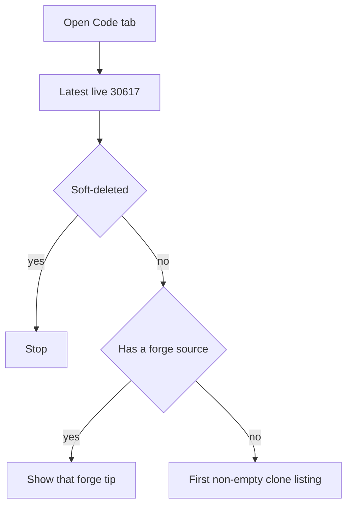

# File Fetching Snippets

Code snippets for parsing Git clone URLs from NIP-34 events — the same classification the gittr Code tab uses.


Who can hold the bytes. **Two layers:**

| Layer | What wins |
| --- | --- |
| **Live repo?** | Latest kind **30617**. Soft-deleted → stop. |
| **File tree?** | Forge **`source`** (no local drafts) is the tree — even if the gittr bridge still has an older listing. No forge, or forge fetch failed → first non-empty `clone[]` listing. gittr does not pick the newest git SHA across mirrors. |



Full timeline, hosts, and README/openFile order: gittr [FILE_FETCHING_INSIGHTS.md](https://gittr.space/npub1n2ph08n4pqz4d3jk6n2p35p2f4ldhc5g5tu7dhftfpueajf4rpxqfjhzmc/gittr?file=docs/FILE_FETCHING_INSIGHTS.md&branch=main).

`parseGitSource` and `isGenericHttpsGitRemoteUrl` match `git-source-fetcher.ts` (`htree://` is Iris Hashtree, not HTTPS git). Pass injectable `knownGraspDomains`.

Star / Watch / Refetch / Commits use the **same** 30617 as the file list (`resolveLiveRepoAnnouncement`). Sidebar clone list: [`filter-display-clone-urls`](../filter-display-clone-urls/). Bridge disk layout: gitnostr `docs/file-fetch-flow.md`.

## Tests (in the gittr / gittr-mcp checkouts)

| Where | Command |
| --- | --- |
| `gittr/ui` | `npm run test:regressions` |
| `gittr-mcp` | `npm run test:regressions` |

## `git-source-parser.ts`

Parses clone URLs and identifies the source type (GitHub, GitLab, Codeberg, GRASP servers, self-hosted, etc.).

**What it does:**
- Parses clone URLs from NIP-34 `clone` tags
- Identifies source type (github, gitlab, codeberg, nostr-git, self-hosted-git, hashtree, unknown)
- Normalizes **`git@host:path`** and `git://` URLs to HTTPS where appropriate
- Treats **`user@host:path`** (no scheme, generic SSH remote) as **`self-hosted-git`**
- **`nostr-git` only** when host is in `knownGraspDomains` **and** path is `/npub1…/repo`, **or** path is `/grasp/npub1…/repo` (home GRASP)
- **Non-GRASP** hosts with `/npub1…/repo` (home Freebox, NAS) → **`self-hosted-git`** (use `GET /api/git/repo-files`)
- **`htree://`** → **`hashtree`** (Iris; not HTTPS git — skip bridge fetch)
- Supports multiple entity formats for Nostr git servers: `npub`, `NIP-05`, and hex pubkey

**Usage:**
```typescript
import { parseGitSource } from './git-source-parser';

const knownGraspDomains = [
  'git.gittr.space',
  'relay.ngit.dev',
  'gitnostr.com',
  'relay.gittr.space', // wss relay — classify tags that still mention it; clone URLs use git.gittr.space
];

const source = parseGitSource('https://github.com/user/repo.git', knownGraspDomains);
// { type: 'github', ... }

// Bridge HTTPS clone (git bytes)
const bridgeSource = parseGitSource(
  'https://git.gittr.space/npub123abc/repo.git',
  knownGraspDomains
);
// { type: 'nostr-git', ... }

const homeSource = parseGitSource(
  'http://myfreebox.example:7334/npub123abc/repo.git',
  knownGraspDomains
);
// { type: 'self-hosted-git', owner: 'npub123abc', ... }  — NOT nostr-git

const iris = parseGitSource(
  'htree://npub1example/repo',
  knownGraspDomains
);
// { type: 'hashtree', displayName: 'Hashtree' }  — not HTTPS git; skip bridge fetch

const pathGrasp = parseGitSource(
  'https://laantungir.net/grasp/npub123abc/repo.git',
  knownGraspDomains
);
// { type: 'nostr-git', npub: 'npub123abc', ... }  — /grasp/ path, even if host is unknown
```

**Extracted from:** `gittr/ui/src/lib/utils/git-source-fetcher.ts`

## File Path Encoding

**CRITICAL**: When making API calls with file paths, always URL-encode the path parameter using `encodeURIComponent()`.

```typescript
const apiUrl = `/api/nostr/repo/file-content?ownerPubkey=${encodeURIComponent(ownerPubkey)}&repo=${encodeURIComponent(repoName)}&path=${encodeURIComponent(filePath)}&branch=${encodeURIComponent(branch)}`;
const gitApiUrl = `/api/git/file-content?sourceUrl=${encodeURIComponent(sourceUrl)}&path=${encodeURIComponent(filePath)}&branch=${encodeURIComponent(branch)}`;
```

## GRASP + self-hosted file trees

1. **Published `clone[]` / `source` are the map.** If the announcement has no clone URLs after the relay query finishes, fill well-known GRASP HTTPS (`buildGraspHttpsCloneCandidates`).
2. A forge **`source`** is the Code-tab tree when there are no local drafts. Otherwise forge/self-hosted HTTPS before GRASP; among those remotes, first non-empty listing.
3. Per GRASP URL: bridge `GET /api/nostr/repo/files` → `GET /api/git/repo-files?sourceUrl=…` → optional `POST /api/nostr/repo/clone`.
4. Per self-hosted URL (including non-GRASP `/npub/…`): **`repo-files` only**.
5. `repo-files` runs on the **gittr server** — home hosts must be reachable from that host.

`fetchFilesFromMultipleSources`: with a forge `source`, that listing is the tree. Among remaining clone hosts, first non-empty listing.

Full details: [FILE_FETCHING_INSIGHTS.md](https://gittr.space/npub1n2ph08n4pqz4d3jk6n2p35p2f4ldhc5g5tu7dhftfpueajf4rpxqfjhzmc/gittr?file=docs/FILE_FETCHING_INSIGHTS.md&branch=main).

## Performance Notes

- **Upstream / non-GRASP first**: avoid 45s timeouts on dead inferred ngit hosts  
- **Parallel GRASP**: every published GRASP `clone[]` HTTPS URL is tried; race returns on first success  
- **GitLab pagination**: GitLab API max 100 items per page — gittr paginates for large trees  
